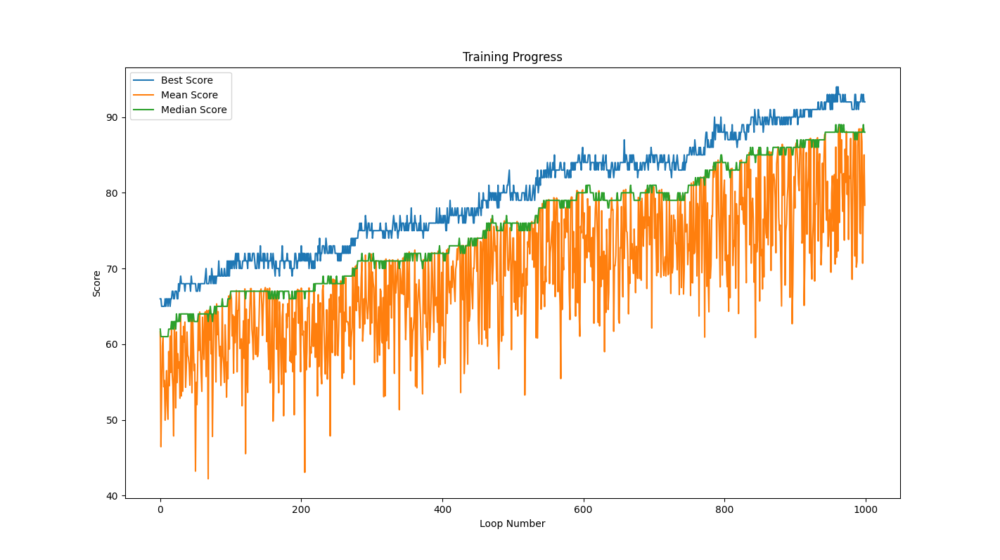
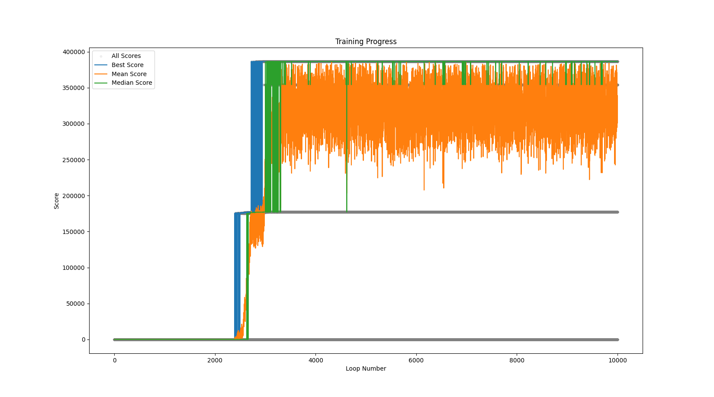

# RC Center Application

**Still a work in progress — probably many lurking issues.**

This repo is the current state of a project I'd like to more fully persue at RC. It’s not fully tested, disorganized, and there are probably a lot of bugs, but it’s the thing I’m most excited about. I feel like its a good representation of my current programming practice.

## Overview

The code works with subsets of finite vector spaces over integers mod a prime, tracking **direction** and **incidence** information. It’s still experimental.

- **`subset.py`**: Slower and heavier, but tracks more detailed information in particular, which pairs determine which directions. I imagine it will be good for visualzations and pulling the terse word representations from the scoring file back to a format that can be more easlity interpreted. In my application, this is my first answer to code you have written from scratch.
- **`lightweight_score.py`**: The core of the project. It’s optimized and faster. If you’re interested in the scoring logic or direction handling, this is where it’s at.

### Key Notes:
- **Normalized Run**: In the normalized run, positive integers are supposed to indicate equidistribution. I expected values to peak around 10–20, but sometimes they break 100. Wether these represent acutal, novel, hard to find examples or simply a coding error is TBD.

## Images

Here’s the current state visually:

- 
- 
- 

These were produced by running

```zsh
python -m pointconfig.threshold_test
```
This is a poorly organized file with a lot of copying and pasting. I am still in the early stages, where I just want to figure out what is possible. Clean organization will come later.

## Requirements

Install dependencies with:

```zsh
pip install -r requirements.txt
```
