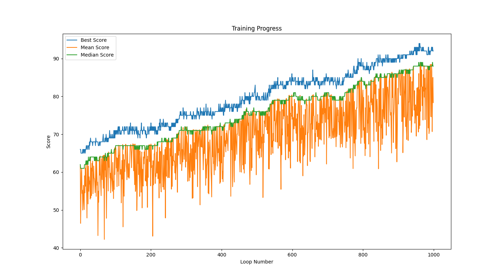
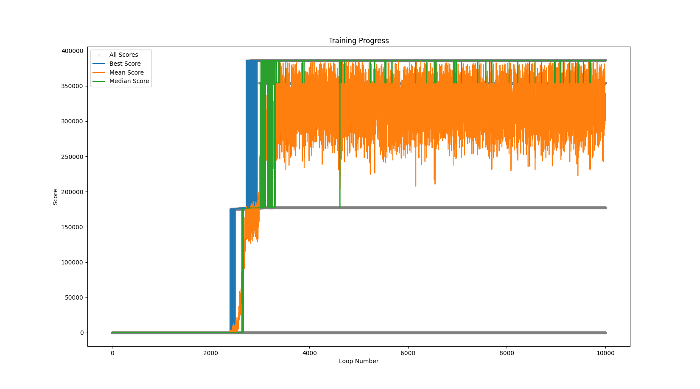
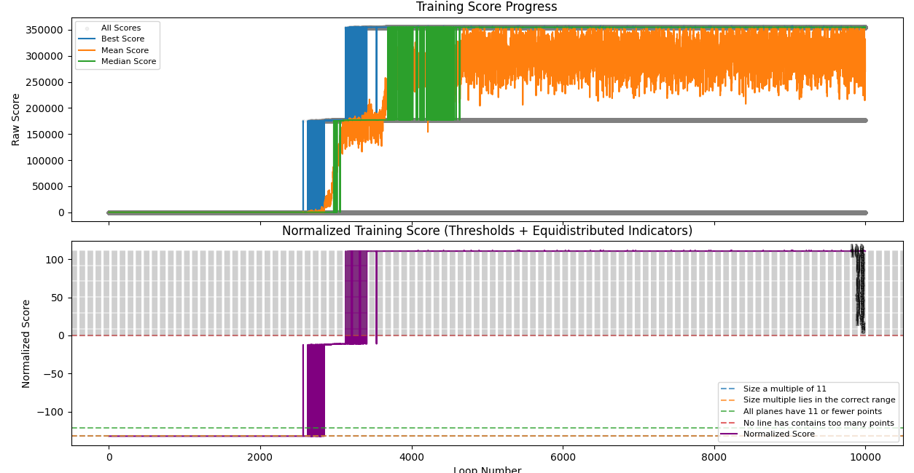

**A work in progress until the underlying math probelm solved... this is research repo**

This is a machine learning project designed to help provide interesting examples relevenat to the discrete Fuglede Conjecture in three dimensions. Its a modest neural net paired with a numba accelerated geometric scoring function. It's currently plateauing... next steps include suping up the underlying model architeture and implementing MCTS.

Here’s the current state visually:

- 
- 
- 
